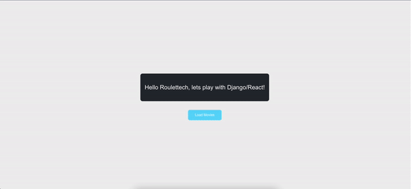

# Empires Top 100 Movies



# React Frontend

This project is a simple React frontend application that fetches and displays a list of movies from a Django backend API.

## Technologies Used

- React
- JavaScript
- CSS

### API Endpoints

- `GET /api/home/`: Fetches the header content.
- `GET /api/movies/`: Fetches the list of movies.


# Django Backend

This project is a simple Django backend that serves API endpoints for fetching header content and a list of movies.

## Technologies Used

- Django
- Python

### API Endpoints

- `GET /api/home/`: Fetches the header content.
- `GET /api/movies/`: Fetches the list of movies.

# Roulettech

A comprehensive project combining a Django backend with a React frontend.

## Prerequisites

Before you begin, ensure you have met the following requirements:
- You have installed Python 3.8 or later.
- You have installed Node.js and npm.
- You have installed virtualenv (optional but recommended).

## Setting Up the Backend

1. **Clone the repository**:

    ```sh
    git clone https://github.com/endtrippy/roulettech.git
    cd roulettech/backend
    ```

2. **Create a virtual environment** (optional but recommended):

    ```sh
    python3 -m venv venv
    source venv/bin/activate
    ```

3. **Install the dependencies**:

    ```sh
    pip install -r requirements.txt
    ```

4. **Run migrations**:

    ```sh
    python manage.py migrate
    ```

5. **Create a superuser**:

    ```sh
    python manage.py createsuperuser
    ```

6. **Run the backend server**:

    ```sh
    python manage.py runserver
    ```

    The backend server will be running on `http://127.0.0.1:8000/`.

## Setting Up the Frontend

1. **Navigate to the frontend directory**:

    ```sh
    cd ../frontend
    ```

2. **Install the dependencies**:

    ```sh
    npm install
    ```

3. **Start the frontend development server**:

    ```sh
    npm start
    ```

    The frontend server will be running on `http://localhost:3000/`.

## Running the Project Locally

To run the project locally, follow these steps:

1. **Start the backend server**:

    Ensure your virtual environment is activated:

    ```sh
    cd backend
    source venv/bin/activate
    python manage.py runserver
    ```

2. **Start the frontend server**:

    Open a new terminal and navigate to the `frontend` directory:

    ```sh
    cd frontend
    npm start
    ```

You should now be able to access the application locally with the frontend at `http://localhost:3000/` and the backend at `http://127.0.0.1:8000/`.

## Repository

The project repository is available at [Roulettech GitHub Repository](https://github.com/endtrippy/roulettech.git).


